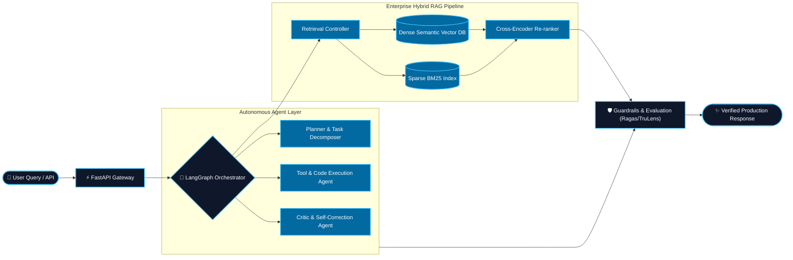

<!-- HERO HEADER WITH ANIMATED WAVE & TYPING EFFECT -->
<div align="center">
  

  <a href="https://git.io/typing-svg">
    
  </a>

  <br/>

  [](https://www.linkedin.com/in/habtamu-feyera-2447a917b/)
  [](https://www.upwork.com/freelancers/~01b3a683f95e6cb332)
  [](https://medium.com/@habtamufeyer02)
  [](https://x.com/Fey9487Feyera)
  [](mailto:habtamufeyera95@gmail.com)

  <br/><br/>
</div>

---

## ⚡ About Me

```python
class GenerativeAIEngineer:
    def __init__(self):
        self.name = "Habtamu Feyera"
        self.role = "Generative AI & Agentic Systems Engineer"
        self.location = "Addis Ababa, Ethiopia"
        self.specialties = [
            "Autonomous Multi-Agent Orchestration (LangGraph, CrewAI)",
            "Enterprise Hybrid RAG (Dense + Sparse + Re-ranking)",
            "Model Alignment & Systemic Evaluation (Ragas, TruLens)",
            "Low-Latency Inference & Production LLMOps"
        ]

    def build_system(self, specification: dict) -> "ProductionGradeAI":
        return autonomous_agent_pipeline(
            specification, 
            guardrails="strict", 
            eval_metrics=["faithfulness", "answer_relevance"]
        )
```

---

## 🏗️ Production AI System Architecture



---

## 🛠️ Core Engineering Pillars

<table>
  <tr>
    <td width="50%" valign="top">
      <h3>🤖 Autonomous Multi-Agent Workflows</h3>
      <ul>
        <li><b>Stateful Architectures:</b> Cyclic graphs, memory persistence, dynamic routing, and sub-agent delegates using <b>LangGraph</b> & <b>CrewAI</b>.</li>
        <li><b>Deterministic Tool Calling:</b> Structured JSON validation, sandbox code execution, and Human-in-the-Loop (HITL) authorization gates.</li>
        <li><b>Self-Correction:</b> ReAct thought-action loops, reflection cycles, and automatic error backtracking.</li>
      </ul>
    </td>
    <td width="50%" valign="top">
      <h3>🔍 Enterprise RAG & Hybrid Retrieval</h3>
      <ul>
        <li><b>Multi-Stage Retrieval:</b> Dense semantic search (OpenAI / BGE) + Sparse BM25 + Cross-Encoder Re-ranking (Cohere / FlashRank).</li>
        <li><b>Intelligent Indexing:</b> Hierarchical chunks, parent-document retrievers, and multi-vector tables.</li>
        <li><b>Context Engineering:</b> Semantic caching, context compression, and hallucination reduction guardrails.</li>
      </ul>
    </td>
  </tr>
  <tr>
    <td width="50%" valign="top">
      <h3>🎯 Model Alignment, Fine-Tuning & Eval</h3>
      <ul>
        <li><b>Parameter-Efficient Tuning:</b> PEFT, LoRA, and QLoRA on domain-specific datasets.</li>
        <li><b>Prompt Optimization:</b> Declarative, algorithmic prompt compilation with <b>DSPy</b>.</li>
        <li><b>Automated Benchmarking:</b> End-to-end evaluation with <b>Ragas</b>, <b>TruLens</b>, and synthetic test datasets.</li>
      </ul>
    </td>
    <td width="50%" valign="top">
      <h3>⚡ LLMOps & Production Infrastructure</h3>
      <ul>
        <li><b>High-Throughput Serving:</b> <b>FastAPI</b>, <b>vLLM</b>, and <b>Ollama</b> for low-latency inference.</li>
        <li><b>Telemetry & Tracing:</b> Full trace observability via <b>LangSmith</b> and <b>Arize Phoenix</b>.</li>
        <li><b>Cloud Native:</b> Microservices containerized with Docker, deployed on Kubernetes, AWS, and GCP.</li>
      </ul>
    </td>
  </tr>
</table>

---

## 🚀 Interactive Project Deep Dives

<details open>
  <summary><b>⚖️ Autonomous Contract Lawyer — Contract QA RAG System</b></summary>
  <br/>
  
  > *Production-focused legal intelligence assistant built to parse, query, cross-examine, and verify complex legal agreements.*

  * **Repository:** [`HabtamuFeyera/contract_QA_Rag_project`](https://github.com/HabtamuFeyera/contract_QA_Rag_project)
  * **Core Innovations:**
    * Hierarchical parent-child document chunking preserving high-level clauses and atomic obligations.
    * Hybrid retrieval (Vector + BM25) coupled with cross-encoder re-ranking to capture subtle legal definitions.
    * Strict citation ground truth verification eliminating hallucinations on liability clauses.
  * **Tech Stack:** `Python` • `LangChain` • `Vector Database` • `FastAPI` • `Jupyter Notebook`
</details>

<details open>
  <summary><b>🕸️ LangGraph Agent UI — Stateful Multi-Agent Visualizer</b></summary>
  <br/>
  
  > *Full-stack reactive interface engineered for monitoring and interacting with cyclic multi-agent graphs in real time.*

  * **Repository:** [`HabtamuFeyera/langgraph-agent-ui`](https://github.com/HabtamuFeyera/langgraph-agent-ui)
  * **Core Innovations:**
    * Real-time WebSocket streaming of agent reasoning steps, state transitions, and token streams.
    * Human-In-The-Loop (HITL) interactive pause/resume mechanism for approving tool actions.
    * Granular state machine inspector showing live node execution histories.
  * **Tech Stack:** `Python` • `LangGraph` • `FastAPI` • `React` • `WebSockets`
</details>

<details open>
  <summary><b>🧠 GenAI-Agents — Modular Reasoning & Tool-Use Engine</b></summary>
  <br/>
  
  > *Extensible multi-agent framework powered by state-of-the-art LLMs with structured thought-action-observation loops.*

  * **Repository:** [`HabtamuFeyera/GenAI-Agents`](https://github.com/HabtamuFeyera/GenAI-Agents)
  * **Core Innovations:**
    * ReAct loop implementation with deterministic fallback handlers and error recovery.
    * Dynamic tool registry supporting calculation engines, live web retrieval, and custom API connectors.
    * Multi-model support across OpenAI, Anthropic, and Google Gemini endpoints.
  * **Tech Stack:** `Python` • `GPT-4 / Claude / Gemini API` • `Asyncio` • `Tool Calling`
</details>

---

## 💻 Technical Arsenal & Ecosystem

<div align="center">
  <!-- Interactive Animated Skill Icons -->
  <a href="https://skillicons.dev">
    
  </a>
  <br/><br/>

  <!-- Specialized AI & LLM Badges -->
  <p>
    
    
    
    
    
    
    
    
    
    
  </p>
</div>

---

## 📊 Live GitHub Activity & Analytics

<div align="center">
  <table border="0">
    <tr>
      <td>
        
      </td>
      <td>
        
      </td>
    </tr>
  </table>
  <br/>
  
</div>

---

## ✍️ Publications & Articles

I regularly author technical deep-dives into Agentic Workflows, Hybrid Retrieval, and LLMOps:
* 🌐 **Read my articles on [Medium (@habtamufeyer02)](https://medium.com/@habtamufeyer02)**

---

## 🤝 Let's Build Together

Whether you are looking to architect an **Autonomous Multi-Agent Workflow**, deploy an **Enterprise RAG System**, or need specialized consulting on **Generative AI Solutions**, feel free to reach out:

<div align="center">
  <a href="https://www.upwork.com/freelancers/~01b3a683f95e6cb332">
    
  </a>
  &nbsp;&nbsp;
  <a href="https://www.linkedin.com/in/habtamu-feyera-2447a917b/">
    
  </a>
  &nbsp;&nbsp;
  <a href="mailto:habtamufeyera95@gmail.com">
    
  </a>
</div>

<br/>

<div align="center">
  
</div>
